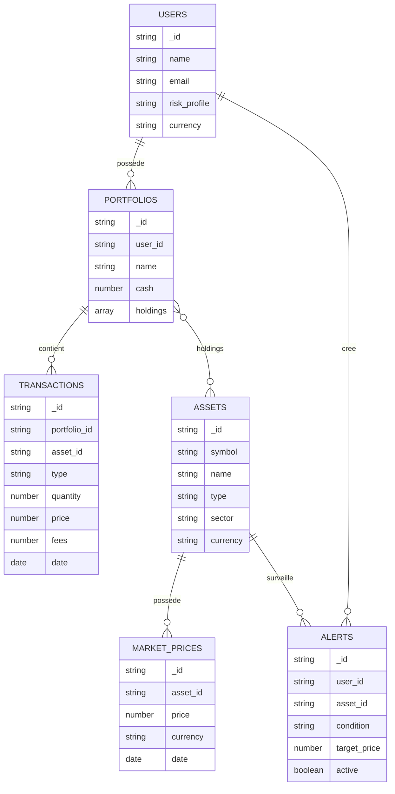

# Projet NoSQL — Applications de finance et d'investissement

## 1. Sujet choisi

**Thème : Applications de finance et d'investissement**

Nom du projet : **FinanceTrack**

FinanceTrack est une application permettant à un utilisateur de suivre ses portefeuilles d'investissement. L'application permet de consulter ses actifs, ses transactions, la valeur actuelle de son portefeuille, ses plus-values ou moins-values, son allocation par type d'actif, son historique de prix et ses alertes d'investissement.

Le projet est basé sur MongoDB, une base de données NoSQL orientée documents.

## 2. But du projet

Le but du projet est de créer une application simple capable de :

- gérer plusieurs utilisateurs ;
- gérer plusieurs portefeuilles d'investissement ;
- stocker des actifs financiers : actions, ETF, cryptomonnaies ;
- enregistrer des transactions d'achat et de vente ;
- suivre les prix de marché ;
- afficher des analyses utiles pour l'utilisateur ;
- exposer les données via une API Flask ;
- afficher les requêtes sur une page web.

## 3. Objectifs

Les objectifs principaux sont :

1. Montrer l'intérêt d'une base NoSQL dans un cas d'utilisation réaliste.
2. Créer une structure MongoDB composée de plusieurs collections.
3. Préparer des données de test cohérentes.
4. Créer 15 besoins utilisateurs.
5. Préparer 15 requêtes MongoDB répondant aux besoins.
6. Exposer les résultats via une API REST.
7. Afficher les résultats sur une page web.

## 4. Pourquoi NoSQL est un bon choix

MongoDB est un bon choix pour ce projet car les données financières peuvent être très variables.

Un utilisateur peut avoir un portefeuille simple avec deux actifs, tandis qu'un autre peut avoir un portefeuille complexe avec plusieurs cryptomonnaies, actions, ETF et alertes. Avec MongoDB, il est possible de stocker directement les positions d'un portefeuille dans un tableau `holdings`, sans devoir créer trop de tables intermédiaires.

MongoDB est aussi adapté car :

- les documents JSON sont proches du format utilisé par une API web ;
- les portefeuilles peuvent contenir des sous-documents ;
- les données peuvent évoluer facilement ;
- les requêtes d'agrégation permettent de calculer des valeurs de portefeuille ;
- les données de marché peuvent être ajoutées régulièrement ;
- la structure est plus souple qu'un modèle SQL classique.

Un SGBD SQL traditionnel serait possible, mais il demanderait plus de tables : utilisateurs, portefeuilles, lignes de portefeuille, actifs, transactions, prix, alertes, tables de jointure, etc. Pour un projet orienté API et documents, MongoDB est plus simple et plus flexible.

## 5. Collections MongoDB

Le projet utilise 6 collections. Le sujet demande au moins 3 à 5 documents, ici on en propose 6 pour rendre le projet plus complet.

### 5.1 Collection `users`

Stocke les utilisateurs.

Exemple :

```json
{
  "_id": "u001",
  "name": "Lina Martin",
  "email": "lina@example.com",
  "risk_profile": "modere",
  "currency": "EUR",
  "created_at": "2026-01-01T10:00:00Z"
}
```

### 5.2 Collection `assets`

Stocke les actifs financiers disponibles.

```json
{
  "_id": "btc",
  "symbol": "BTC",
  "name": "Bitcoin",
  "type": "crypto",
  "sector": "Crypto",
  "currency": "USD"
}
```

### 5.3 Collection `portfolios`

Stocke les portefeuilles et leurs positions.

```json
{
  "_id": "p001",
  "user_id": "u001",
  "name": "Portefeuille long terme",
  "cash": 1200,
  "base_currency": "EUR",
  "holdings": [
    {
      "asset_id": "cw8",
      "quantity": 20,
      "average_buy_price": 430
    },
    {
      "asset_id": "btc",
      "quantity": 0.05,
      "average_buy_price": 55000
    }
  ]
}
```

### 5.4 Collection `transactions`

Stocke les achats et ventes.

```json
{
  "_id": "t001",
  "portfolio_id": "p001",
  "asset_id": "cw8",
  "type": "buy",
  "quantity": 20,
  "price": 430,
  "fees": 2,
  "date": "2026-01-10T10:00:00Z"
}
```

### 5.5 Collection `market_prices`

Stocke les prix de marché.

```json
{
  "_id": "price_btc",
  "asset_id": "btc",
  "price": 68000,
  "currency": "USD",
  "date": "2026-06-01T10:00:00Z"
}
```

### 5.6 Collection `alerts`

Stocke les alertes de prix.

```json
{
  "_id": "al001",
  "user_id": "u001",
  "asset_id": "btc",
  "condition": "price_above",
  "target_price": 70000,
  "active": true,
  "created_at": "2026-06-01T10:00:00Z"
}
```

## 6. Diagramme des documents et relations



## 7. Besoins utilisateurs

1. En tant qu'utilisateur, je veux voir la valeur totale de mon portefeuille.
2. En tant qu'utilisateur, je veux voir mes positions ligne par ligne.
3. En tant qu'utilisateur, je veux connaître mes gains ou pertes non réalisés.
4. En tant qu'utilisateur, je veux connaître la répartition de mon portefeuille par type d'actif.
5. En tant qu'utilisateur, je veux connaître la répartition par secteur.
6. En tant qu'utilisateur, je veux consulter mes dernières transactions.
7. En tant qu'utilisateur, je veux connaître mon prix moyen d'achat par actif.
8. En tant qu'utilisateur, je veux voir combien j'ai investi chaque mois.
9. En tant qu'utilisateur, je veux voir les actifs les plus importants dans tous les portefeuilles.
10. En tant qu'utilisateur, je veux consulter l'historique de prix d'un actif.
11. En tant qu'utilisateur, je veux rechercher un actif par nom, symbole, secteur ou type.
12. En tant qu'utilisateur, je veux voir mes alertes actives.
13. En tant qu'utilisateur, je veux savoir si une alerte de prix est déclenchée.
14. En tant qu'administrateur, je veux voir la répartition des utilisateurs par profil de risque.
15. En tant qu'utilisateur, je veux obtenir un score simple de diversification.

## 8. Requêtes préparées

Les requêtes sont disponibles dans le fichier `app/queries.py`.

| N° | Besoin | Endpoint API |
|---:|---|---|
| 1 | Lister les utilisateurs | `/api/users` |
| 2 | Lister les actifs | `/api/assets` |
| 3 | Valeur de tous les portefeuilles | `/api/portfolios/value` |
| 4 | Résumé d'un portefeuille | `/api/portfolio/p001/summary` |
| 5 | Allocation par type | `/api/portfolio/p001/allocation/type` |
| 6 | Allocation par secteur | `/api/portfolio/p001/allocation/sector` |
| 7 | Transactions récentes | `/api/portfolio/p001/transactions` |
| 8 | Prix moyen d'achat | `/api/portfolio/p001/average-buy-price` |
| 9 | Investissements mensuels | `/api/investments/monthly` |
| 10 | Top actifs globaux | `/api/assets/top` |
| 11 | Historique de prix | `/api/asset/btc/prices` |
| 12 | Recherche d'actifs | `/api/assets/search?q=btc` |
| 13 | Alertes actives | `/api/alerts/active` |
| 14 | Alertes déclenchées | `/api/alerts/triggered` |
| 15 | Répartition profils risque | `/api/users/risk-profiles` |
| 16 | Score de diversification | `/api/portfolio/p001/diversification` |
| 17 | Portefeuilles au-dessus d'une valeur | `/api/portfolios/above/8000` |

## 9. API REST

L'API est développée avec Flask. Elle se connecte à MongoDB via PyMongo.

Exemples d'endpoints :

```txt
GET /api/users
GET /api/assets
GET /api/portfolio/p001/summary
GET /api/portfolio/p001/allocation/type
GET /api/portfolio/p001/transactions
GET /api/alerts/triggered
```

## 10. Page web

La page web est disponible sur :

```txt
http://localhost:5000
```

Elle permet de :

- remplir la base de données ;
- lancer les requêtes API ;
- afficher les résultats JSON ;
- rechercher un actif.

## 11. Étapes de démonstration

1. Lancer MongoDB et l'application.
2. Ouvrir la page web.
3. Cliquer sur `Remplir la base`.
4. Tester les boutons de requêtes.
5. Montrer que les données viennent de MongoDB.
6. Montrer une requête d'agrégation dans le code.
7. Expliquer pourquoi NoSQL est adapté au projet.

## 12. Conclusion

FinanceTrack répond au sujet car il s'agit d'un cas d'utilisation NoSQL appliqué à une application de finance et d'investissement. Le projet contient plusieurs collections MongoDB, des documents imbriqués, des données de test, des requêtes d'agrégation, une API Flask et une interface web permettant de démontrer les résultats.
